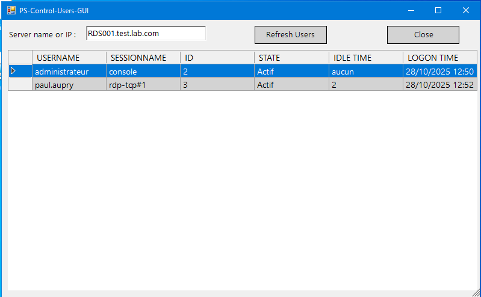

 

# PS-Control-Users-GUI
* [Fr] : Script PowerShell avec interface Windows Forms pour contrôle des utilisateurs connectés sur un serveur (Exemple : Serveur RDS)
* [En] : PowerShell script with Windows Forms interface to control users connected to a server (Example: RDS Server)

# Utilisation de la commande
```powershell
  quser /SERVER:serveur
```
- Affiche des informations sur les sessions utilisateur sur un serveur hôte de session Bureau à distance.
- https://learn.microsoft.com/fr-fr/windows-server/administration/windows-commands/quser
- Works with : ✅ Windows Server 2025, ✅ Windows Server 2022, ✅ Windows Server 2019, ✅ Windows Server 2016, ✅ Windows 11, ✅ Windows 10, ✅ Azure Local 2311.2 and later
-----------------------------------

# 
